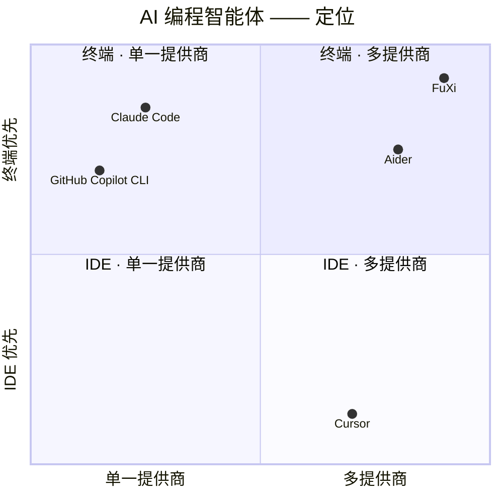

# FuXi

[English](README.md) | [简体中文](README.zh-CN.md)

> **一个住在你终端里的 AI 编程智能体。**
> 代号 **一画开天 (YiHuaKaiTian)**。

FuXi 是一个快速、自包含的 AI 开发者终端：在丰富的 TUI 中读代码、改文件、
运行命令、驱动工具，并在多个 LLM 提供商之间进行成本感知的路由与自动故障
转移。单个静态二进制文件，无运行时依赖。

**终端优先** · **不绑定提供商** · **自带密钥** · **MCP 客户端** · **自动更新**

主页：**https://fuxicode.com**


---

## 目录

- [亮点](#亮点)
- [与同类产品的对比](#与同类产品的对比)
- [评估与基准](#评估与基准)
- [安装](#安装)
- [快速开始](#快速开始)
- [使用指南](#使用指南)
- [项目结构](#项目结构)
- [License](#license)

## 亮点

- **多 LLM 路由** —— 一个智能体，多家提供商。一等支持：
  - **Anthropic**（原生 Messages API），以及 **AWS Bedrock** / **Google Vertex**
    上的 Anthropic
  - **OpenAI 兼容**接口（OpenAI、**Azure OpenAI**，以及任何 OpenAI 风格 API）
  - **Google Gemini**
  - 通过 OpenAI 兼容接口支持的主流开源/国产模型 —— **GLM（智谱）**、
    **DeepSeek**、**Qwen**、 **Hunyuan**、 **Doubao**、 **Ernie（文心一言）**、**Grok (xAI)** 等
- **智能路由层** —— 成本感知路由、向健康提供商的自动**故障转移**、
  主备并发**竞速**（可选），以及从配置中解析出的角色化模型分层
  （快速 / 主力 / 推理）。
- **深度工具集** —— 文件读/改/写、带安全分类器的 shell（`bash` / PowerShell）、
  网页抓取、代码搜索、基于 LSP 的诊断、Jupyter notebook、通过 MCP 实现的
  computer/browser use、后台任务，以及并行**子智能体**。
- **MCP 客户端** —— 接入任意 Model Context Protocol 服务器（stdio、HTTP 或
  WebSocket），其工具即可被智能体直接调用。
- **可扩展** —— hooks、skills、plugins，以及用户自定义斜杠命令。
- **持久化会话** —— 持久的会话记录、检查点/恢复、空闲期的"梦境"记忆整理，
  以及长对话下的自动上下文压缩。
- **自带密钥，或直接登录** —— 使用提供商 API Key，或通过 FuXi OAuth 登录。
  走 FuXi 托管路径时无需任何密钥。
- **自动更新** —— 后台版本检查加一条 `fuxi update` 命令即可保持安装是最新的，
  替换正在运行的二进制文件前会先做校验和验证。

---

## 与同类产品的对比

FuXi 是一个终端优先、设计上不绑定任何单一提供商的 AI 编程智能体。
下表反映的是各产品官方公开的定位，以及 FuXi 目前实际提供的能力；
产品迭代很快，请将其作为定位参考，而非详细规格。

| | FuXi | Claude Code | GitHub Copilot CLI | Cursor | Aider |
|---|---|---|---|---|---|
| 终端优先的 CLI / TUI | ✓ | ✓ | ✓ | ✗（基于 IDE） | ✓ |
| 多提供商支持 | ✓ | ✗（仅 Anthropic） | ✗（需 Copilot 套餐） | ✓ | ✓ |
| 自带 API Key | ✓ | ✓ | ✗（订阅制） | ✓ | ✓ |
| 成本感知路由与故障转移 | ✓ | ✗ | ✗ | ✗ | ✗ |
| MCP 客户端 | ✓ | ✓ | ✗ | ✓ | ✗ |
| 并行子智能体 | ✓ | ✓ | ✗ | ✓ | ✗ |
| 持久会话与检查点 | ✓ | ✓ | ✗ | ✓ | ✗ |
| 单个静态二进制、无运行时依赖 | ✓ | ✗（依赖 Node） | ✗（依赖 Node） | ✗（IDE 应用） | ✗（依赖 Python） |



---

## 评估与基准

FuXi 以可复现、可自行验证的评估为原则。目前它尚未在第三方基准
（如 SWE-bench、Terminal-Bench、Aider polyglot 等）上公布官方分数；
我们更愿意提供可自行操作的评估方法，而不是一个孤立的数字。
下面是在你自己的项目上评估 FuXi 的方法：

**一份可操作的评估清单**

1. **安装与自检** —— 安装后先运行 `fuxi doctor` 验证环境
   （配置、API Key、git、ripgrep），再运行 `fuxi verify` 确认与提供商
   的连接。自检通过是评估的基准线。
2. **复现一个真实任务** —— 在你自己的项目中挑一个失败的测试，让 FuXi
   修复它；随后扩展模块并重新运行测试套件（上方演示动画就是这一流程）。
   再用日常任务重复几轮：代码审查、提交、PR、重构。
3. **同条件对比** —— 用完全相同的任务、模型与上下文，让另一款工具执行
   同样的工作，再比较正确性、工具覆盖、成本与迭代时间。同一起跑线上
   的对比才公平。

FuXi 提供了对比所需的一切手段 —— TUI 内的 `/cost`、`/usage`、`/context`、
`/status` —— 以及内置的环境自检（`fuxi doctor`）。未来若公布基准成绩，
将在此章节附上链接。

---

## 安装

### macOS / Linux

```bash
curl -fsSL https://releases.fuxicode.com/bootstrap.sh | bash
```

### Windows（PowerShell）

```powershell
irm https://releases.fuxicode.com/bootstrap.ps1 | iex
```

### Windows（CMD）

```bat
curl -fsSL https://releases.fuxicode.com/install.cmd -o "%TEMP%\fuxi-install.cmd" && "%TEMP%\fuxi-install.cmd"
```

以上三种方式都会安装到 `~/.local/bin`（Windows 上为
`%USERPROFILE%\.local\bin`），并在尚未加入时自动加进你的**用户** `PATH`。
再次运行同一条命令即可原地升级已有安装 —— 安装和升级是同一条命令。

默认安装最新版本；也可以带参数指定具体版本，例如
`./bootstrap.sh 2.202.194` 或 `./bootstrap.ps1 2.202.194`。

### 验证安装

```bash
fuxi --version
fuxi doctor      # 环境自检（配置、API Key、git、ripgrep 等）
```

### 卸载

```bash
# macOS / Linux
rm -f "$HOME/.local/bin/fuxi"
rm -rf "$HOME/.fuxi"   # 可选：连同配置/状态一起删除

# Windows（PowerShell）
Remove-Item -Force "$env:USERPROFILE\.local\bin\fuxi.exe"
Remove-Item -Recurse -Force "$env:USERPROFILE\.fuxi"   # 可选
```

---

## 快速开始

启动 TUI：

```bash
fuxi
```

首次运行时，FuXi 会在 `~/.fuxi/` 下创建配置。你需要一个可对话的模型，
有两条路径可选：

1. **登录** —— `fuxi login` 会打开浏览器，用你的 FuXi 账号完成认证，
   随后自动开通 FuXi 托管模型。无需任何 API Key。
2. **自带密钥** —— 通过环境变量设置提供商 API Key，或直接编写
   `~/.fuxi/config.yaml`（`fuxi init` 会生成一份初始模板，并根据当前
   已设置的环境变量自动探测提供商）：

   ```yaml
   provider: openapi
   base_url: https://your-endpoint/v1
   api_key: <your-key>       # 或改用 export FUXI_API_KEY
   model: glm-4.6
   ```

   需要同时管理多个提供商/模型？使用分层 schema —— 一份 `providers:`
   目录加一层 `model:` 选择：

   ```yaml
   providers:
     custom:
       type: openapi
       base_url: https://your-endpoint/v1
       api_key: <your-key>
       models:
         - id: deepseek-v4-pro-260425
           model_canonical_name: deepseek-v4-pro   # 可选：用于能力查询
   model:
     active: { provider: custom, id: deepseek-v4-pro-260425 }
   ```

   完整的分层 schema（多提供商、按模型的能力覆盖、路由角色）请参见本仓库
   的 `config.full.example.yaml`。

   或者运行 `fuxi wizard` 进入交互式配置流程（选择提供商、输入
   base URL/密钥、选择模型、测试连接）。

配置好模型后，随时可用 `/model` 切换，用 `/config` 管理其余设置 ——
权限、hooks、skills、plugins 等一切都通过 TUI 内的斜杠命令驱动。

---

## 使用指南

### 命令行参数

启动 `fuxi` 时最常用的参数：

| 参数 | 作用 |
|---|---|
| `-m, --model <name>` | 本次运行覆盖使用的模型 |
| `-k, --api-key <key>` | 本次运行覆盖使用的 API Key |
| `-b, --base-url <url>` | 覆盖 base URL（启用 OpenAPI 提供商） |
| `-P, --provider <type>` | 提供商类型：`anthropic` \| `openapi` |
| `-r, --resume <sessionId>` | 恢复某个指定的历史会话 |
| `-c, --continue` | 继续当前目录下最近一次会话 |
| `-d, --dir <path>` | 工作目录 |
| `--permission-mode <mode>` | `default` \| `plan` \| `bypassPermissions` |
| `--auto` | 自动批准安全的工具调用（经分类器判定，带熔断机制） |
| `--dangerously-skip-permissions` | 跳过所有权限检查（请谨慎使用） |
| `--worktree` | 为本次会话创建一个 git worktree |
| `--thinking <mode>` | `enabled` \| `adaptive` \| `disabled` |
| `--mcp-config <configs...>` | 从 JSON 字符串或文件路径加载 MCP 服务器 |
| `--status` | 打印解析后的提供商状态并退出 |
| `--config` | 打印解析后的配置并退出 |
| `--debug [pattern]` | 开启调试日志，可选按标签过滤 |
| `-v, --version` / `-h, --help` | 版本信息 / 完整的参数与命令参考 |

完整列表（还有采样控制、工具限制、系统提示词覆盖、hook 触发器、
swarm/agent 相关参数等）请运行 `fuxi --help`。

### 子命令

| 命令 | 作用 |
|---|---|
| `fuxi` | 启动交互式 TUI（等同于 `fuxi tui`） |
| `fuxi login` | 登录 FuXi 账号并配置凭据 |
| `fuxi setup-token` | 登录并打印一个用于 `FUXI_OAUTH_TOKEN` 的 token（无交互/CI 场景） |
| `fuxi wizard` | 交互式配置向导：提供商、base URL、密钥、模型、连接测试 |
| `fuxi init [--force]` | 生成一份 `~/.fuxi/config.yaml` 模板 |
| `fuxi doctor` | 诊断你的环境（配置、密钥、git、ripgrep、环境变量覆盖） |
| `fuxi verify` | 验证与已配置提供商的连通性 |
| `fuxi info` | 显示解析后的提供商与模型信息 |
| `fuxi update [version]` | 下载、校验并安装新版本 |
| `fuxi agents` | 按来源列出已配置的 agent |
| `fuxi proxy` | 启动本地 Anthropic↔OpenAI 智能路由代理 |
| `fuxi launch [args]` | 使用你的 FuXi 配置，通过代理启动另一个工具 |
| `fuxi mcp serve` | 将 FuXi 自身作为 MCP stdio 服务器运行 |
| `fuxi remote-control` | 作为云端远程控制 worker 运行（`--remote-control` 的别名） |

### TUI 内斜杠命令

输入 `/` 并回车（或 Tab 补全）浏览全部命令。最常用的：

| 命令 | 作用 |
|---|---|
| `/help`, `/commands`, `/menu` | 显示或搜索全部命令 |
| `/model` | 切换当前使用的模型 |
| `/config` | 打开配置 |
| `/status` | 显示提供商状态 |
| `/context` | 显示当前上下文窗口占用情况 |
| `/cost`, `/usage` | 会话花费 / 套餐用量 |
| `/compact` | 压缩对话历史以释放上下文空间 |
| `/clear` | 清空对话 |
| `/history`, `/resume` | 浏览或恢复历史会话/检查点 |
| `/tools` | 列出可用工具 |
| `/permissions` | 显示当前权限配置 |
| `/memory` | 显示项目记忆文件 |
| `/fork` | 显示子智能体（fork）统计信息 |
| `/commit` | 创建一次 git 提交 |
| `/review` | 审查代码 / 打开 PR |
| `/doctor` | 运行诊断检查 |
| `/copy`, `/paste` | 复制上一条回复 / 将剪贴板文本作为下一条提示发送 |
| `/exit` | 退出 |

**键盘操作：** `/` 加回车打开命令浏览器 · `Tab` 补全斜杠命令 ·
`Ctrl+R` 搜索历史提示词 · 支持终端粘贴 / 括号粘贴以处理大段粘贴内容。

### 更新

FuXi 会在后台检查新版本，一旦有可用更新会打印一行提示。原地更新：

```bash
fuxi update            # 最新版本
fuxi update 2.203.0    # 指定版本
```

`fuxi update` 会下载目标版本，对照已发布的 manifest 校验 SHA-256，
并原子性地替换正在运行的二进制文件 —— 不会留下安装到一半的中间状态。
可通过 `--no-update-notifier` 或 `NO_UPDATE_NOTIFIER=1` 关闭后台检查提示。

### 配置

- **配置目录：** `~/.fuxi/`（可用 `FUXI_CONFIG_DIR` 覆盖）。
- **配置文件：** `~/.fuxi/config.yaml` —— 提供商、模型、
  thinking/effort、智能路由、脱敏，以及按端点的能力覆盖。FuXi 运行期间
  修改会热加载。每个字段的完整说明见本仓库的 `config.full.example.yaml`。
- **优先级：** 环境变量 > `config.yaml` > 内置默认值。
- **项目设置：** 项目内提交的 `.claude/settings.json`（权限、hooks）
  会按项目生效。
- **插件：** 官方插件市场位于 `fuxicode.com/plugins`。

常用环境变量：

| 变量 | 作用 |
|---|---|
| `ANTHROPIC_API_KEY` | Anthropic API Key |
| `FUXI_BASE_URL` / `FUXI_API_KEY` / `FUXI_MODEL` | OpenAPI 兼容提供商配置 |
| `ANTHROPIC_MODEL` | Anthropic 提供商使用的模型名 |
| `FUXI_THINKING_MODE` / `FUXI_THINKING_EFFORT` | `auto\|enabled\|disabled` / `low\|medium\|high\|max` |
| `FUXI_CONFIG_DIR` | 覆盖配置目录（默认 `~/.fuxi`） |
| `NO_UPDATE_NOTIFIER` | 设为 `1` 时关闭后台更新检查提示（等同 `--no-update-notifier`） |
| `FUXI_TEMPERATURE` / `FUXI_TOP_P` / `FUXI_SEED` | 采样控制参数 |

完整的环境变量参考（包括 bridge/remote-control、沙箱限制、MCP 资源上限
等）请运行 `fuxi --help`。

---

## 项目结构

本仓库承载 FuXi 的文档、安装包与 issue 追踪。产品源码为闭源，未在本仓库
发布（见 License）。

---

## License

**闭源。** Copyright © 2026 FUXI（上海翊太科技有限公司 / Shanghai YiTai Technology Co., Ltd.）。保留所有权利。
