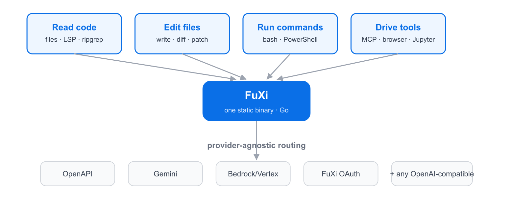
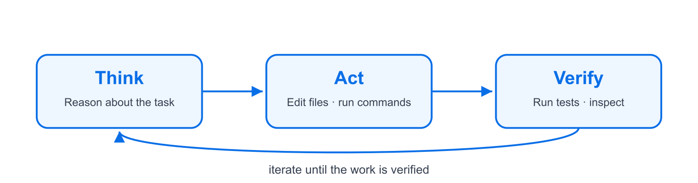
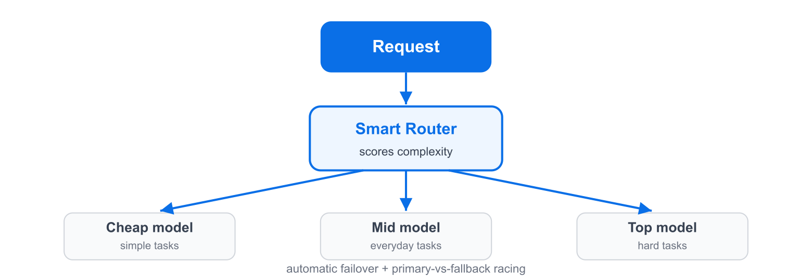
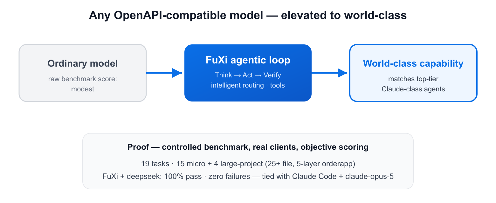
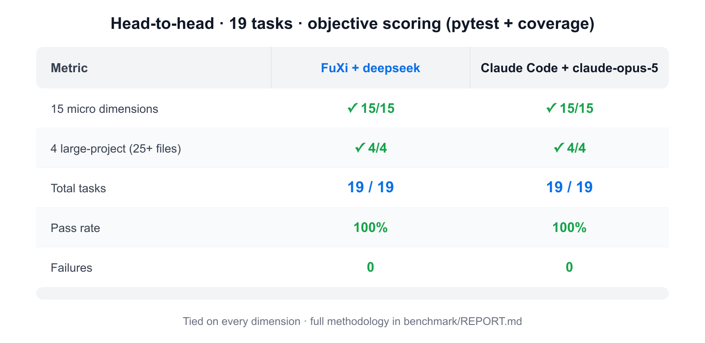

# FuXi

[English](README.md) | [简体中文](README.zh-CN.md)

[](https://github.com/fuxicodex/Fuxi/stargazers)
[](https://github.com/fuxicodex/Fuxi/releases)
[](https://github.com/fuxicodex/Fuxi/commits/main)
[](LICENSE)

> **一个住在你终端里的 AI 编程智能体。**

FuXi 是一个快速、自包含的**终端 AI 编程智能体**：在丰富的 TUI 中读代码、改
文件、运行命令、驱动工具，并在多个 LLM 提供商之间进行成本感知的路由与自动
故障转移。FuXi 使用 Go 语言开发，交付为单个静态二进制文件，无运行时依赖。
可以把它理解为不绑定单一提供商的 Claude Code 替代方案：接入任意 OpenAI 兼容
模型，就能在其上获得 思考 → 行动 → 验证 的智能体循环。

**终端优先** · **不绑定提供商** · **自带密钥** · **MCP 客户端** · **自动更新**

主页：**https://www.fuxicode.com**


> **第一次接触 FuXi？** 直接看[快速开始](#快速开始) —— 大约一分钟就能跑起
> 一个可以用的会话。完整指南见[使用指南](docs/usage.zh-CN.md)。

---

## 目录

- [快速开始](#快速开始)
- [亮点](#亮点)
- [与同类产品的对比](#与同类产品的对比)
- [文档](#文档)
- [评估与基准](#评估与基准)
- [项目结构](#项目结构)
- [License](#license)

## 快速开始

### 1. 安装

macOS / Linux：

```bash
curl -fsSL https://downloads.fuxicode.com/bootstrap.sh | bash
```

Windows（PowerShell）：

```powershell
irm https://downloads.fuxicode.com/bootstrap.ps1 | iex
```

Windows（CMD）：

```bat
curl -fsSL https://downloads.fuxicode.com/install.cmd -o "%TEMP%\fuxi-install.cmd" && "%TEMP%\fuxi-install.cmd"
```

安装程序会把 FuXi 放到 `~/.local/bin`（Windows 上为
`%USERPROFILE%\.local\bin`），并在尚未加入时自动加进你的**用户** `PATH`。
以后重跑同一条命令即可升级 —— 安装和升级是同一条命令。

### 2. 验证

```bash
fuxi --version
fuxi doctor      # 环境自检（配置、API Key、git、ripgrep 等）
```

### 3. 启动

```bash
fuxi
```

首次运行时，FuXi 会在 `~/.fuxi/` 下创建配置，随后需要注册并登录 ——
**使用 FuXi 必须要有 FuXi 账号**：

1. **注册并登录（必需）** —— `fuxi login` 注册或认证你的 FuXi 账号并授予
   访问权限。无交互/CI 场景用 `fuxi setup-token` 打印可导出为
   `FUXI_OAUTH_TOKEN` 的令牌。注册仅处理最少账户数据 —— **你的代码与对话
   绝不上传**（零内容上传）。

2. **连接模型（可选）** —— 登录后即可使用 FuXi 托管模型。若想改用自己的
   提供商，请自带密钥：通过环境变量设置提供商 API Key，或直接编写
   `~/.fuxi/config.yaml`（`fuxi init` 会生成一份初始模板）：

   ```yaml
   provider: openapi
   base_url: https://your-endpoint/v1
   api_key: <your-key>       # 或改用 export FUXI_API_KEY
   model: your-model
   ```

   需要同时管理多个提供商/模型？使用分层 schema —— 一份 `providers:`
   目录加一层 `model:` 选择：

   ```yaml
   providers:
     custom:
       type: openapi
       base_url: https://your-endpoint/v1
       api_key: <your-key>
       models:
         - id: your-model-id
   model:
     active: { provider: custom, id: your-model-id }
   ```

   或者运行 `fuxi wizard` 进入交互式配置流程 —— 选择提供商、输入 base URL
   与密钥、选择模型，并测试连接。

> **隐私一览：** 账号是必需的，内容不是。零内容上传 —— 详见
> [安全与隐私保护体系](security-privacy/README.md)。

### 4. 开干

输入提示词并回车，例如：

```text
修复这个仓库里失败的测试。
```

FuXi 会推理、改文件、运行命令，并验证结果。头几分钟常用的几个命令：

- `/model` —— 随时切换模型 · `/help` —— 浏览全部命令 · `/exit` —— 退出
- 工具首次运行时可能请求授权 —— 用 `/permissions` 查看
- `fuxi -r <sessionId>` 或 `fuxi -c` 恢复过去的对话；会话会自动保存

就是这么个循环。升级、卸载、快捷键、MCP 与完整的命令行参考，见
[使用指南](docs/usage.zh-CN.md)。

---

## 亮点

**模型只是引擎，FuXi 才是整车。** 模型单独只能回答问题；FuXi 让它成为真正
的工人 —— 推理、在你真实的代码库上行动、验证结果，并且成本可控、尽在你
掌握之中。



### 围绕核心循环构建

- **思考 → 行动 → 验证** —— FuXi 推理任务、用工具行动、检查结果，并不断
  迭代直到工作完成且被验证：失败的测试被修复、测试套件全绿、PR 就绪。

  

- **成本感知的智能路由** —— 每个请求按复杂度评分并路由到合适的模型档位：
  简单任务交给廉价模型，困难任务保留给强模型，并带自动故障转移。

  

### 50+ 工具，单个静态二进制

- **直接上手真实代码库** —— 文件读/写/改、shell（`bash` / PowerShell）、
  ripgrep 搜索、网页抓取、LSP 诊断、Jupyter、浏览器控制、后台任务与并行
  子智能体 —— 无需任何运行时依赖。
- **天生可扩展** —— MCP 客户端、hooks、skills、plugins 与斜杠命令，全部
  支持热重载。
- **默认安全** —— shell 命令在执行前经过 AST 安全分类器；细粒度权限与
  本地审计日志让自主执行始终处于你的掌控中。
- **工作不丢失** —— 会话记录保存在磁盘，检查点支持恢复、回滚或分叉，
  长对话自动压缩，并有跨会话的"梦境"记忆整理。

### 属于你的：密钥、数据与成本

- **自带密钥，或使用托管模型** —— 使用 FuXi 必须有 FuXi 账号；可接入任意
  OpenAI 兼容 / Gemini / Bedrock / Vertex API Key，或使用 FuXi 托管模型。
- **零内容上传、本地优先** —— 你的代码、提示词与对话绝不上传到 FuXi；配置、
  凭据、会话与记忆留在你的设备 `~/.fuxi/` 下，请求直达你选择的提供商。
- **自动更新** —— 后台版本检查加一条 `fuxi update`，替换二进制前先做校验
  和验证。
- **适龄设计** —— 儿童与未成年人可以使用 FuXi：法律要求时取得监护人同意、
  不做行为广告或画像，并建议成年人监督。
- **如实的能力边界** —— FuXi 是工具而非顾问：它会说明自己做了什么、敏感操作
  前先征得同意，绝不声称超出实际的可靠性。

### 用数据说话

同样的 思考 → 行动 → 验证 循环与智能路由，能让任意 OpenAPI 兼容模型发挥出
高于其原生基准的表现 —— 已在可复现任务集上与另一款编码智能体做了对照测试
（[benchmark](benchmark/REPORT.zh-CN.md)）。



---

## 与同类产品的对比

FuXi 是一个终端优先、设计上不绑定任何单一提供商的 AI 编程智能体。
能力对照基于各产品官方公开定位（2026 年中）；产品迭代很快，
请将其作为定位参考。

### 实测对比



两个系统各自通过原生客户端、在相同 baseline 与相同客观评分工具
（pytest + coverage）下，于 15 个微观维度与 4 个大型项目维度上进行对比。
完整方法、原始数据、环境版本、具体命令与已知局限都记录在
[`benchmark/REPORT.zh-CN.md`](benchmark/REPORT.zh-CN.md)，可供核实或自行复现。

> 坦率说明：这是一套自测的小规模任务集，并非第三方基准，且衡量的是
> **智能体循环**而非模型裸分。请把它当作一个参考数据点，而非结论性标题。

---

## 文档

完整参考文档都在 `docs/` 下，中英对照。

| 文档 | 内容 |
|---|---|
| [使用指南](docs/usage.zh-CN.md) | 完整指南：第一次会话、权限与安全、会话与记忆、工具与 MCP、完整命令行参考、更新与排障 |
| [键盘快捷键](docs/keybindings.zh-CN.md) | 终端 UI 按键速查 |
| [环境变量](docs/environment.zh-CN.md) | 完整环境变量参考（含桥接/远程控制、沙箱限制、MCP 资源上限） |
| [常见问题](docs/faq.zh-CN.md) | 常见问题解答 |
| [安全与隐私](security-privacy/README.md) | 治理章程、政策、标准、流程、[全球隐私与法律风险地图](security-privacy/compliance/GLOBAL_LAW_MAP.zh-CN.md)与信任中心 |
| [更新日志](CHANGELOG.md) | 版本发布记录 |
| [支持](SUPPORT.md) | 获取帮助与报告问题的方式 |

> 提示：在你安装的二进制上运行 `fuxi --help`，可随时获得权威的参数、命令与
> 环境变量参考。

---

## 评估与基准

FuXi 以可复现、可自行验证的评估为原则。目前它尚未在第三方基准
（如 SWE-bench、Terminal-Bench、Aider polyglot 等）上公布官方分数；
我们更愿意提供可自行操作的评估方法，而不是一个孤立的数字。
下面是在你自己的项目上评估 FuXi 的方法：

**一份可操作的评估清单**

1. **安装与自检** —— 安装后先运行 `fuxi doctor` 验证环境
   （配置、API Key、git、ripgrep），再运行 `fuxi verify` 确认与提供商
   的连接。自检通过是评估的基准线。
2. **复现一个真实任务** —— 在你自己的项目中挑一个失败的测试，让 FuXi
   修复它；随后扩展模块并重新运行测试套件（上方演示动画就是这一流程）。
   再用日常任务重复几轮：代码审查、提交、PR、重构。
3. **同条件对比** —— 用完全相同的任务、模型与上下文，让另一款工具执行
   同样的工作，再比较正确性、工具覆盖、成本与迭代时间。同一起跑线上
   的对比才公平。

FuXi 提供了对比所需的一切手段 —— TUI 内的 `/cost`、`/usage`、`/context`、
`/status` —— 以及内置的环境自检（`fuxi doctor`）。未来若公布基准成绩，
将在此章节附上链接。

---

## 项目结构

本仓库承载 FuXi 的文档、安装包与 issue 追踪。产品源码为闭源，未在本仓库
发布（见 License）。

- `README.md` / `README.zh-CN.md` — 主文档（英文 / 简体中文）
- `docs/` — 演示 GIF、对比图、使用指南、快捷键速查、环境变量参考与常见问题
- `security-privacy/` — 安全与隐私保护体系：治理章程、政策、标准、流程、
  全球合规矩阵与信任中心
- `benchmark/` — 可复现的评测方法论与结果
- `CHANGELOG.md` — 版本发布记录
- `CONTRIBUTING.md`、`CODE_OF_CONDUCT.md`、`SECURITY.md`、`SUPPORT.md` —
  社区与支持指南

---

## License

**闭源。** Copyright © 2026 FUXI。保留所有权利。