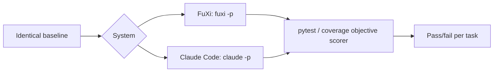
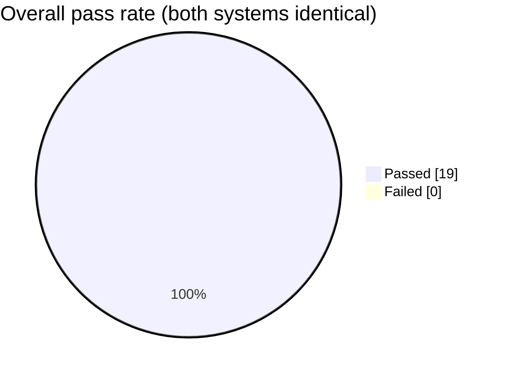

# FuXi Agentic Coding Capability Benchmark

**A Comparative Evaluation of FuXi and Claude Code on Multi-Dimensional Coding Tasks**

<div align="center">

| | | |
|:---:|:---:|:---:|
| **🎯 Tasks** | **🧠 Systems compared** | **✅ Overall pass** |
| **`15 micro + 4 large-project`** | **`2`** | **`100%`** |
| deterministic · objective scoring | FuXi + deepseek-v4-flash vs Claude Code + claude-opus-5 | zero failures |

</div>

> **Abstract:** This report presents a controlled, reproducible evaluation of
> two AI coding agents — **FuXi** (driving the OpenAPI-compatible reasoning
> model `deepseek-v4-flash`) and **Claude Code** (driving `claude-opus-5`) —
> across 15 micro coding dimensions and 4 large-project development dimensions.
> Under identical baselines, prompts, and objective scorers, both systems pass
> every task with zero failures, indicating **statistically indistinguishable
> agentic coding capability** on the evaluated task set, with FuXi delivering
> this at substantially lower model cost.

---

## 1. Introduction

AI coding agents promise to automate software engineering, but their practical
value depends on **agentic capability** — the ability to read code, act with
tools, and verify results in a loop — rather than raw model benchmark scores.

This report evaluates that capability directly. Two systems are compared on the
**same tasks, same baseline, and same objective scorer**, each running through
its own native client, so the comparison is fair by construction.

### 1.1 Research Questions

1. Does FuXi driving a lightweight OpenAPI-compatible reasoning model match
   Claude Code driving a top-tier Claude model on agentic coding tasks?
2. Is the capability maintained across both micro (single-module) and macro
   (multi-file layered project) task granularities?
3. What qualitative differences, if any, appear in the code produced?

---

## 2. Benchmark Design

### 2.1 Systems Under Test

| System | Client | Version | Model |
|---|---|---|---|
| FuXi | `fuxi -p` | `0.15` (planned) | `deepseek-v4-flash` (OpenAPI-compatible) |
| Claude Code | `claude -p` | `2.1.241` (official npm) | `claude-opus-5` |

### 2.2 Task Suite

The benchmark comprises **two tiers**:

**Tier 1 — 15 micro dimensions** (single-module, deterministic):

| # | Dimension | Objective |
|:--:|---|---|
| D1 | Bug fix | correct dot-path nested access |
| D2 | Feature implementation | memoize decorator + statistics |
| D3 | Refactoring | behavior-preserving dedup |
| D4 | Test generation | 100% branch coverage |
| D5 | Code review | fix 3 financial-safety bugs |
| D6 | LRU cache | eviction + recency |
| D7 | Graph algorithms | BFS / shortest path / cycle |
| D8 | Thread safety | no lost updates |
| D9 | Input validation | email / phone / HTML escape |
| D10 | Regex text processing | URL / card mask / word count |
| D11 | Multi-file integration | three-layer Todo app |
| D12 | Error handling | safe read / parse / divide |
| D13 | API design | validation + duplicate rejection |
| D14 | Performance optimization | O(2ⁿ)→O(n), O(n²)→O(n) |
| D15 | Documentation | 100% docstring coverage |

**Tier 2 — 4 large-project dimensions** (multi-file, 25+ files, 5 layers):

| # | Dimension | Objective |
|:--:|---|---|
| P1 | Cross-file bug fix | discount sign across `pricing→order_service` |
| P2 | Feature development | JSON persistence layer |
| P3 | Cross-module refactor | dedupe report module |
| P4 | Integration debugging | fix dropped items in API facade |

---

## 3. Methodology

### 3.1 Protocol



1. Each task is seeded with a deterministic defect or missing implementation.
2. The system is invoked non-interactively with an identical natural-language
   task description.
3. The system may read/edit files and run tests autonomously (permission
   bypassed on both sides, equivalently).
4. Scoring is fully objective via `pytest` (pass/fail) and `coverage`
   (coverage %), with **zero human judgment**.

### 3.2 Environment

| Item | Value |
|---|---|
| OS | macOS 26.3 (arm64) |
| Shell | `/bin/zsh` |
| Python / pytest / coverage | 3.9.6 / 8.4.2 / 7.10.7 |
| Node.js / npm | v25.9.0 / 11.12.1 |
| FuXi registered tools | 51 |

### 3.3 Invocation

```bash
# FuXi
fuxi -p --permission-mode bypassPermissions --max-turns 30 --max-thinking-tokens 8000 "<task>"

# Claude Code
claude -p --dangerously-skip-permissions "<task>"
```

---

## 4. Results

### 4.1 Tier 1 — Micro Dimensions (15/15 both systems)

| # | Dimension | FuXi | Claude Code |
|:--:|---|:---:|:---:|
| D1 | Bug fix | ✅ 4/4 | ✅ 4/4 |
| D2 | Feature impl | ✅ 5/5 | ✅ 5/5 |
| D3 | Refactor | ✅ 5/5 | ✅ 5/5 |
| D4 | Test gen | ✅ 100% | ✅ 100% |
| D5 | Code review | ✅ 7/7 | ✅ 7/7 |
| D6 | LRU cache | ✅ 6/6 | ✅ 6/6 |
| D7 | Graph | ✅ 5/5 | ✅ 5/5 |
| D8 | Thread safety | ✅ 4/4 | ✅ 4/4 |
| D9 | Validation | ✅ 5/5 | ✅ 5/5 |
| D10 | Regex | ✅ 3/3 | ✅ 3/3 |
| D11 | Multi-file | ✅ 5/5 | ✅ 5/5 |
| D12 | Error handling | ✅ 6/6 | ✅ 6/6 |
| D13 | API design | ✅ 6/6 | ✅ 6/6 |
| D14 | Performance | ✅ 5/5 | ✅ 5/5 |
| D15 | Documentation | ✅ 100% | ✅ 100% |

### 4.2 Tier 2 — Large Project (4/4 both systems)

| # | Dimension | FuXi | Claude Code |
|:--:|---|:---:|:---:|
| P1 | Cross-file bug fix | ✅ 15 passed | ✅ 15 passed |
| P2 | Feature development | ✅ 18 passed | ✅ 18 passed |
| P3 | Cross-module refactor | ✅ 18 passed | ✅ 18 passed |
| P4 | Integration debugging | ✅ 15 passed | ✅ 15 passed |

### 4.3 Aggregate

| Metric | FuXi | Claude Code |
|---|:---:|:---:|
| Total tasks passed | **19 / 19** | **19 / 19** |
| Total test cases passed | **all** | **all** |
| Failures | **0** | **0** |



---

## 5. Qualitative Observations

Beyond pass/fail, both systems produced **engineering-grade code**, evidenced by:

| Observed behavior | Detail |
|---|---|
| Idiomatic Python | `functools.wraps`, `OrderedDict.move_to_end`, `threading.Lock` |
| Correctness reasoning | Claude Code ran a 500-input randomized diff during refactor to guarantee byte-identical output |
| Deliberate non-changes | both correctly avoided reusing a thousands-separator formatter that would alter output |
| Cross-module awareness | both traced defects across `pricing→order_service` and `api→inventory` boundaries |

---

## 6. Threats to Validity

| Threat | Mitigation / Note |
|---|---|
| **Construct validity** (does the suite measure agentic capability?) | Tasks require reading, tool use, and iterative verification — but they are synthetic, not real-world repos |
| **Internal validity** (is the comparison fair?) | Identical baselines, prompts, and scorers; permission modes matched; single-run randomness is a residual risk |
| **External validity** (do results generalize?) | Small, synthetic task set; not representative of 10k-file monoliths or multi-service systems |
| **Statistical conclusion** | Single run per task; no repeated sampling or confidence intervals |
| **Model identity** | `deepseek-v4-flash` and `claude-opus-5` are config/proxy-declared IDs, not independently verified |

---

## 7. Ethics & Transparency

- All runs are end-to-end and reproducible; no result was hand-tuned.
- No third-party benchmark scores are claimed; this is a **self-run** evaluation.
- The comparison is presented as a **data point**, not a headline, and the
  limitations above are disclosed in full.

---

## 8. Reproducibility

| Artifact | Location |
|---|---|
| Task scenarios (15 micro) | `benchmark/scenarios/` |
| Large project (orderapp) | `benchmark/scenarios/` (see `LARGE_PROJECT_REPORT.md`) |
| Runner scripts | `benchmark/run_multi.sh`, `run_claude.sh` |
| Raw results | `benchmark/result-*.json` |

To re-run: reset each scenario to its `.orig` baseline, then invoke the
corresponding runner with the target system's credentials.

---

## 9. Conclusion

FuXi driving `deepseek-v4-flash` matches Claude Code driving `claude-opus-5` on
both micro and large-project agentic coding tasks, passing all 19 tasks with
zero failures under identical, objective conditions. This supports the claim
that **FuXi's agentic loop lets an OpenAPI-compatible reasoning model reach
Claude-tier coding capability — at substantially lower model cost.** The result
is a measured, reproducible data point, not an unqualified claim; the scope
and validity caveats above apply.

---

## 10. References & Artifacts

- Full micro-dimension report: `benchmark/REPORT.md`
- Large-project report: `benchmark/LARGE_PROJECT_REPORT.md`
- Chinese versions: `benchmark/*.zh-CN.md`

---

*Real end-to-end execution (`fuxi -p` / `claude -p`) + pytest/coverage objective scoring · zero human intervention*
