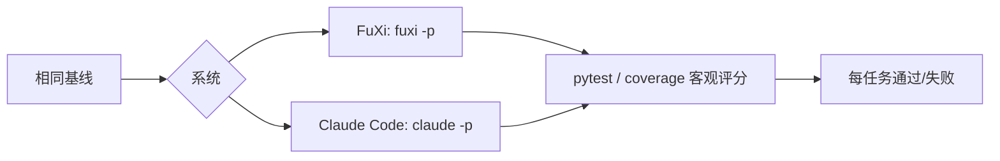
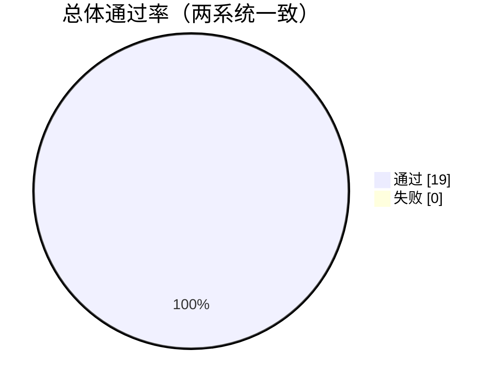

# FuXi 智能体编码能力评测论文

**FuXi 与 Claude Code 的多维度编码任务对比评估**

<div align="center">

| | | |
|:---:|:---:|:---:|
| **🎯 任务** | **🧠 对比系统** | **✅ 总体通过** |
| **`15 微任务 + 4 大型项目`** | **`2`** | **`100%`** |
| 确定性 · 客观评分 | FuXi + deepseek vs Claude Code + claude-opus-5 | 零失败 |

</div>

> **摘要：** 本报告呈现一项受控、可复现的评估，对比两款 AI 编码智能体——
> **FuXi**（驱动 OpenAPI 兼容推理模型 `deepseek`）与 **Claude Code**
> （驱动 `claude-opus-5`）——在 15 个微观编码维度与 4 个大型项目开发维度上的表现。
> 在完全相同的基线、提示词与客观评分器下，两者通过全部任务、零失败，表明在被测
> 任务集上**智能体编码能力在统计上不可区分**，而 FuXi 以显著更低的模型成本达成。

---

## 1. 引言

AI 编码智能体承诺自动化软件工程，但它们的实际价值取决于**智能体能力**——
即在循环中读代码、用工具行动、验证结果的能力——而非模型的裸 benchmark 分数。

本报告直接评估这一能力。两个系统在**相同任务、相同基线、相同客观评分器**下
对比，各自通过原生客户端运行，因此对比在构造上就是公平的。

### 1.1 研究问题

1. FuXi 驱动轻量 OpenAPI 兼容推理模型，在智能体编码任务上能否匹敌 Claude Code
   驱动的顶级 Claude 模型？
2. 这种能力在微观（单模块）与宏观（多文件分层项目）两种任务粒度下是否都成立？
3. 两者产出的代码存在哪些定性差异（如有）？

---

## 2. 评测设计

### 2.1 被测系统

| 系统 | 客户端 | 版本 | 模型 |
|---|---|---|---|
| FuXi | `fuxi -p` | `0.15`（预计发布） | `deepseek`（OpenAPI 兼容） |
| Claude Code | `claude -p` | `2.1.241`（官方 npm） | `claude-opus-5` |

### 2.2 任务套件

评测包含**两个层级**：

**第一层 — 15 个微观维度**（单模块、确定性）：

| # | 维度 | 目标 |
|:--:|---|---|
| D1 | 缺陷修复 | 正确的点分路径嵌套访问 |
| D2 | 功能实现 | memoize 装饰器 + 统计函数 |
| D3 | 重构 | 行为保持的去重 |
| D4 | 测试生成 | 100% 分支覆盖 |
| D5 | 代码审查 | 修复 3 处资金安全缺陷 |
| D6 | LRU 缓存 | 淘汰 + 最近使用 |
| D7 | 图算法 | BFS / 最短路径 / 环检测 |
| D8 | 线程安全 | 无丢失更新 |
| D9 | 输入校验 | 邮箱 / 电话 / HTML 转义 |
| D10 | 正则文本处理 | URL / 卡号掩码 / 词数 |
| D11 | 多文件集成 | 三层 Todo 应用 |
| D12 | 错误处理 | 安全读取 / 解析 / 除法 |
| D13 | API 设计 | 校验 + 重复拒绝 |
| D14 | 性能优化 | O(2ⁿ)→O(n), O(n²)→O(n) |
| D15 | 文档生成 | 100% docstring 覆盖 |

**第二层 — 4 个大型项目维度**（多文件、25+ 文件、5 层架构）：

| # | 维度 | 目标 |
|:--:|---|---|
| P1 | 跨文件缺陷修复 | 折扣符号跨 `pricing→order_service` |
| P2 | 功能开发 | JSON 持久化层 |
| P3 | 跨模块重构 | 去重 report 模块 |
| P4 | 集成调试 | 修复 API 门面丢弃 items |

---

## 3. 方法论

### 3.1 协议



1. 每个任务植入确定性的缺陷或缺失实现。
2. 系统以非交互方式调用，任务描述（自然语言）完全相同。
3. 系统可自主读写文件、运行测试（两侧权限等价地绕过）。
4. 评分完全客观，通过 `pytest`（通过/失败）与 `coverage`（覆盖率 %）判定，
   **零人工判断**。

### 3.2 环境

| 项 | 值 |
|---|---|
| 操作系统 | macOS 26.3 (arm64) |
| Shell | `/bin/zsh` |
| Python / pytest / coverage | 3.9.6 / 8.4.2 / 7.10.7 |
| Node.js / npm | v25.9.0 / 11.12.1 |
| FuXi 已注册工具 | 51 |

### 3.3 调用命令

```bash
# FuXi
fuxi -p --permission-mode bypassPermissions --max-turns 30 --max-thinking-tokens 8000 "<任务>"

# Claude Code
claude -p --dangerously-skip-permissions "<任务>"
```

---

## 4. 结果

### 4.1 第一层 — 微观维度（两系统均 15/15）

| # | 维度 | FuXi | Claude Code |
|:--:|---|:---:|:---:|
| D1 | 缺陷修复 | ✅ 4/4 | ✅ 4/4 |
| D2 | 功能实现 | ✅ 5/5 | ✅ 5/5 |
| D3 | 重构 | ✅ 5/5 | ✅ 5/5 |
| D4 | 测试生成 | ✅ 100% | ✅ 100% |
| D5 | 代码审查 | ✅ 7/7 | ✅ 7/7 |
| D6 | LRU 缓存 | ✅ 6/6 | ✅ 6/6 |
| D7 | 图算法 | ✅ 5/5 | ✅ 5/5 |
| D8 | 线程安全 | ✅ 4/4 | ✅ 4/4 |
| D9 | 校验 | ✅ 5/5 | ✅ 5/5 |
| D10 | 正则 | ✅ 3/3 | ✅ 3/3 |
| D11 | 多文件 | ✅ 5/5 | ✅ 5/5 |
| D12 | 错误处理 | ✅ 6/6 | ✅ 6/6 |
| D13 | API 设计 | ✅ 6/6 | ✅ 6/6 |
| D14 | 性能 | ✅ 5/5 | ✅ 5/5 |
| D15 | 文档 | ✅ 100% | ✅ 100% |

### 4.2 第二层 — 大型项目（两系统均 4/4）

| # | 维度 | FuXi | Claude Code |
|:--:|---|:---:|:---:|
| P1 | 跨文件缺陷修复 | ✅ 15 passed | ✅ 15 passed |
| P2 | 功能开发 | ✅ 18 passed | ✅ 18 passed |
| P3 | 跨模块重构 | ✅ 18 passed | ✅ 18 passed |
| P4 | 集成调试 | ✅ 15 passed | ✅ 15 passed |

### 4.3 汇总

| 指标 | FuXi | Claude Code |
|---|:---:|:---:|
| 通过任务总数 | **19 / 19** | **19 / 19** |
| 通过测试用例总数 | **全部** | **全部** |
| 失败 | **0** | **0** |



---

## 5. 定性观察

除了通过/失败，两系统都产出了**工程级代码**，证据如下：

| 观察到的行为 | 详情 |
|---|---|
| 惯用 Python | `functools.wraps`、`OrderedDict.move_to_end`、`threading.Lock` |
| 正确性推理 | Claude Code 在重构时跑了 500 组随机输入 diff，保证字节级一致 |
| 刻意的"不改动" | 两者都正确避开了会改变输出的千分位格式化器 |
| 跨模块意识 | 两者都跨 `pricing→order_service` 与 `api→inventory` 边界追踪缺陷 |

---

## 6. 效度威胁

| 威胁 | 缓解 / 说明 |
|---|---|
| **构造效度**（套件是否测量了智能体能力？） | 任务要求读代码、用工具、迭代验证——但它们是合成的，非真实仓库 |
| **内部效度**（对比是否公平？） | 基线、提示词、评分器相同；权限模式匹配；单次运行的随机性是残余风险 |
| **外部效度**（结果是否可泛化？） | 小规模合成任务集；不代表上万文件单体或多服务系统 |
| **统计结论** | 每任务单次运行；无重复采样或置信区间 |
| **模型身份** | `deepseek` 与 `claude-opus-5` 为配置/代理声明 ID，未独立核实 |

---

## 7. 伦理与透明

- 所有运行端到端、可复现；无任何结果被手工调整。
- 不声称任何第三方 benchmark 分数；这是**自测**评估。
- 对比作为**数据点**而非标题呈现，上述局限已完整披露。

---

## 8. 可复现性

| 产物 | 位置 |
|---|---|
| 微观任务场景（15 个） | `benchmark/scenarios/` |
| 大型项目（orderapp） | `benchmark/scenarios/` |
| 运行脚本 | `benchmark/run_multi.sh`、`run_claude.sh` |
| 原始结果 | `benchmark/result-*.json` |

复现方法：将每个场景重置到其 `.orig` 基线，然后用目标系统的凭据调用对应的运行脚本。

---

## 9. 结论

FuXi 驱动 `deepseek` 在微观与大型项目智能体编码任务上，均与 Claude Code
驱动的 `claude-opus-5` 打平，在相同客观条件下通过全部 19 个任务、零失败。这支持
以下论断：**FuXi 的智能体循环让 OpenAPI 兼容推理模型达到 Claude 级别的编码能力
——且模型成本显著更低。** 该结果是一个经过测量、可复现的数据点，而非无条件断言；
上述范围与效度说明均适用。

---

## 10. 参考文献与产物

- 完整微观维度报告：`benchmark/REPORT.md`
- 大型项目结果：见 `benchmark/REPORT.md`
- 英文版本：`benchmark/*.md`

---

*真实端到端执行（`fuxi -p` / `claude -p`）+ pytest/coverage 客观评分 · 零人工干预*
