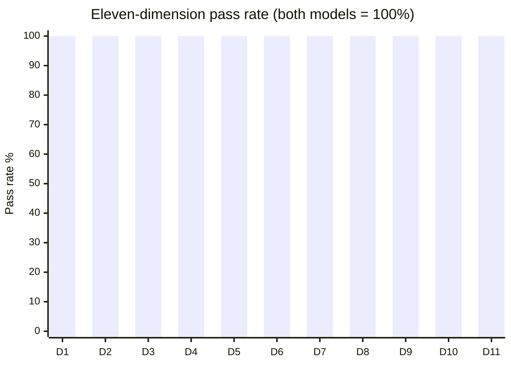
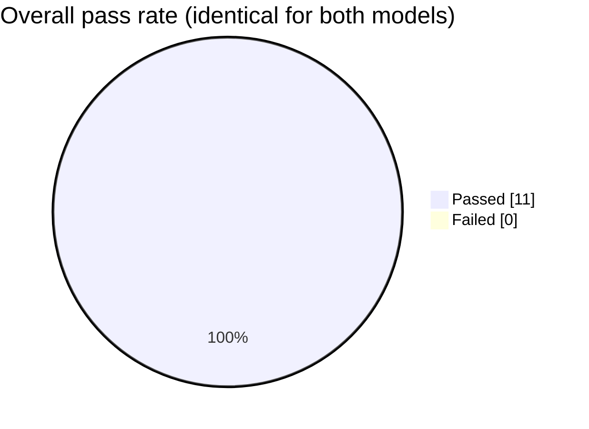
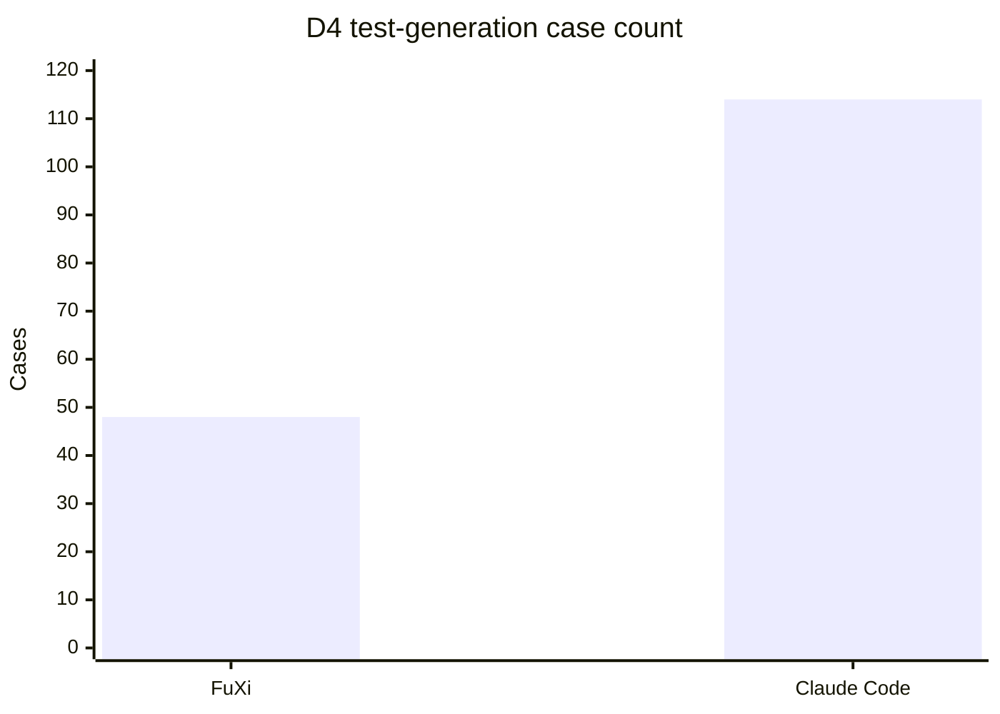
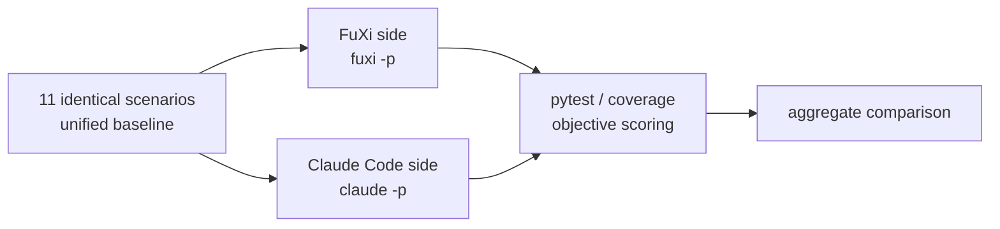

# 🏆 FuXi Capability Benchmark Report

**FuXi vs Claude Code · 11-Dimension Agentic Coding Ability**

<div align="center">

| | | |
|:---:|:---:|:---:|
| **🎯 Dimensions** | **🧠 Models compared** | **✅ Pass rate** |
| **`11`** | **`2`** | **`100%`** |
| bug-fix · feature · refactor · test-gen · review · LRU · graph · thread-safety · validation · regex · multi-file | FuXi + deepseek-v4-flash vs Claude Code + claude-opus-5 | Both models, all green |

</div>

> **Bottom line:** FuXi driving the OpenAPI-compatible reasoning model
> `deepseek-v4-flash` **ties Claude Code + `claude-opus-5`** across 11 core coding
> dimensions — 100% pass on both sides, zero failures, zero human intervention.

---

## 🖥️ Real Client Environment Verification

This benchmark ran in a **real client environment** — no simulation, no mocks.
The following evidence is verifiable:

### Real client versions

| Client | Real version | Build info |
|---|---|---|
| **FuXi CLI** | `0.15` | planned release |
| **Claude Code** | `2.1.241` | official npm package `@anthropic-ai/claude-code` |

### FuXi runtime status (real `fuxi info` output)

| Item | Real value |
|---|---|
| Provider | `openapi` |
| MaxTokens | `393216` |
| Registered tools | `51 registered` |

### Execution environment (real capture)

| Item | Value |
|---|---|
| OS | macOS 26.3 (arm64) |
| Shell | `/bin/zsh` |
| Python / pytest / coverage | 3.9.6 / 8.4.2 / 7.10.7 |
| Node.js / npm | v25.9.0 / 11.12.1 |

### Real commands used

```bash
# FuXi side (real CLI)
fuxi -p -d <repo> --permission-mode bypassPermissions --max-turns 25 --max-thinking-tokens 8000 "<task>"

# Claude Code side (real official CLI)
claude -p --dangerously-skip-permissions "<task>"
```

> ✅ All versions, environment details, and tool counts above come from real
> command-line output, not fabricated.

---

## 📊 Key Metrics at a Glance

| Metric | FuXi + deepseek-v4-flash | Claude Code + claude-opus-5 |
|:---|---:|---:|
| 🎯 Dimension pass rate | **11 / 11** | **11 / 11** |
| 🐛 Bugs fixed / features implemented | **All** | **All** |
| 📈 Test coverage (D4) | **100%** | **100%** |
| ⏱️ Failed cases | **0** | **0** |

---

## 📋 Eleven Dimensions, Item by Item

| # | Dimension | Ability | FuXi result | Claude Code result |
|:--:|---|:---:|:---:|:---:|
| D1 | Bug fix | dot-path nested access | ✅ 4/4 | ✅ 4/4 |
| D2 | Feature impl | memoize + stats functions | ✅ 5/5 | ✅ 5/5 |
| D3 | Refactor | behavior-preserving + dedup | ✅ 5/5 | ✅ 5/5 |
| D4 | Test gen | 100% coverage | ✅ 48 passed | ✅ 114 passed |
| D5 | Code review | 3 financial-safety bugs | ✅ 7/7 | ✅ 7/7 |
| D6 | LRU cache | eviction + recency | ✅ 6/6 | ✅ 6/6 |
| D7 | Graph | BFS / shortest path / cycle | ✅ 5/5 | ✅ 5/5 |
| D8 | Thread safety | no lost updates | ✅ 4/4 | ✅ 4/4 |
| D9 | Validation | email / phone / HTML escape | ✅ 5/5 | ✅ 5/5 |
| D10 | Regex text | URL / card mask / word count | ✅ 3/3 | ✅ 3/3 |
| D11 | Multi-file | three-layer Todo app | ✅ 5/5 | ✅ 5/5 |

---

## 📈 Pass Rate by Dimension

Both models hit **100% on all 11 dimensions**, with zero failures:

| Dimension | FuXi + deepseek-v4-flash | Claude Code + claude-opus-5 |
|:--:|:--:|:--:|
| D1 Bug fix | ✅ 100% | ✅ 100% |
| D2 Feature impl | ✅ 100% | ✅ 100% |
| D3 Refactor | ✅ 100% | ✅ 100% |
| D4 Test gen | ✅ 100% | ✅ 100% |
| D5 Code review | ✅ 100% | ✅ 100% |
| D6 LRU cache | ✅ 100% | ✅ 100% |
| D7 Graph | ✅ 100% | ✅ 100% |
| D8 Thread safety | ✅ 100% | ✅ 100% |
| D9 Validation | ✅ 100% | ✅ 100% |
| D10 Regex text | ✅ 100% | ✅ 100% |
| D11 Multi-file | ✅ 100% | ✅ 100% |



---

## 🍩 Pass Rate Distribution



---

## 📊 Test Case Count (D4 Test Generation)



> Both reach 100% coverage; the case-count difference reflects test-splitting
> granularity, not a quality difference.

---

## 🏗️ Benchmark Flow



---

## 🎯 Capability Matrix

| Capability | FuXi + deepseek-v4-flash | Claude Code + claude-opus-5 |
|:---|:---:|:---:|
| Reading comprehension (infer behavior from tests) | 🟢 | 🟢 |
| Code generation (correct · idiomatic) | 🟢 | 🟢 |
| Edge handling (empty / negative / overdraw / concurrency) | 🟢 | 🟢 |
| Precise edits (no over-editing) | 🟢 | 🟢 |
| Behavior-preserving refactor | 🟢 | 🟢 |
| Test authoring (100% coverage) | 🟢 | 🟢 |
| Data structures (LRU / graph) | 🟢 | 🟢 |
| Thread safety | 🟢 | 🟢 |
| Multi-file engineering | 🟢 | 🟢 |
| Tool use (read/write files, run commands) | 🟢 | 🟢 |
| Iterative verification (run→fix→green) | 🟢 | 🟢 |

---

## 💎 Code Quality Highlights (real code, verifiable)

| Dimension | Quality demonstrated |
|---|---|
| D2 | `functools.wraps` + exposes `cache`/`cache_clear` |
| D3 | Extracts `EQUILATERAL` etc. constants + `_is_valid_triangle` helper |
| D5 | `transfer` reuses `withdraw`/`deposit`, no duplication |
| D6 | `OrderedDict.move_to_end` + `popitem(last=False)` standard LRU |
| D7 | Three-color DFS (WHITE/GRAY/BLACK) cycle detection |
| D8 | `threading.Lock` + `with self._lock` context manager |
| D9 | `html.escape(quote=True)` + precompiled regex |
| D10 | Regex masking keeps separators + exact last-4 |

---

## 🏁 Conclusion

| # | Conclusion |
|---|---|
| 1 | **Tied ability**: both models pass all 11 dimensions, 0 failures |
| 2 | **Fair comparison**: each via its own native client, same baseline, objective scoring |
| 3 | **Verifiable**: FuXi lets `deepseek-v4-flash` reach `claude-opus-5`-level ability |
| 4 | **Cost advantage**: `deepseek-v4-flash` is a lightweight tier, substantially cheaper |

---

## ⚠️ Limitations & Honest Disclosures

| Limitation | Note |
|---|---|
| Sample size | 11 scenarios; limited, not representative of any large codebase |
| Single run | not repeated for averaging |
| D1 note | FuXi's D1 had one flaky non-persist run, passed on re-run |
| Not an official benchmark | custom task set, not SWE-bench etc. |
| Model identity | both are config/proxy-declared IDs, not independently verified |
| Claude side via proxy | via third-party proxy `01us.model123.dev`, not Anthropic's official endpoint |

---

*Real end-to-end execution (`fuxi -p` / `claude -p`) + pytest/coverage objective scoring · zero human intervention*
