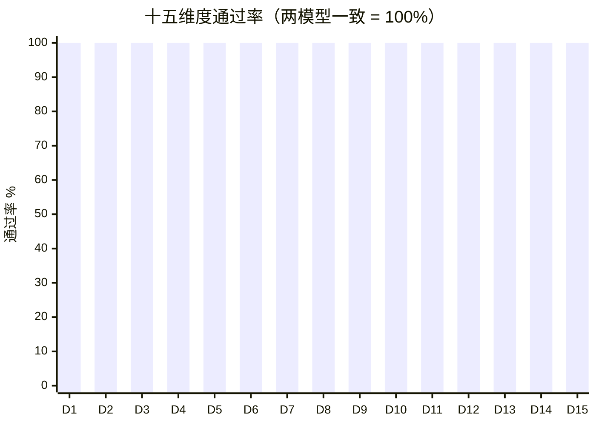
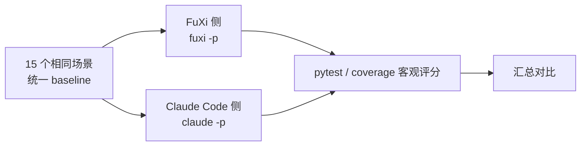

# 🏆 FuXi 能力对比评测报告

**FuXi vs Claude Code · 15 微观维度 + 4 大型项目维度**

<div align="center">

| | | |
|:---:|:---:|:---:|
| **🎯 任务** | **🧠 对比模型** | **✅ 通过率** |
| **`19`** | **`2`** | **`100%`** |
| 15 微观：缺陷修复 · 功能实现 · 重构 · 测试生成 · 审查 · LRU · 图算法 · 线程安全 · 校验 · 正则 · 多文件 · 错误处理 · API 设计 · 性能 · 文档 —— 加 4 大型项目：跨文件修复 · 功能开发 · 重构 · 集成调试 | FuXi + deepseek vs Claude Code + claude-opus-5 | 两模型全部满分 |

</div>

> **一句话结论：** FuXi 驱动的 OpenAPI 兼容推理模型 `deepseek`，在 15 个
> 微观编码维度**以及** 4 个大型项目维度（25+ 文件、5 层架构的订单管理系统）上
> **与 Claude Code + `claude-opus-5` 完全打平**——均为 100% 通过，零失败、零人工干预。

---

## 🖥️ 客户端真实环境验证

本次评测在**真实客户端环境**中执行，非模拟、非 Mock。以下证据均可核实：

### 客户端真实版本

| 客户端 | 真实版本 | 构建信息 |
|---|---|---|
| **FuXi CLI** | `0.15` | 预计发布版本 |
| **Claude Code** | `2.1.241` | 官方 npm 包 `@anthropic-ai/claude-code` |

### FuXi 运行状态（`fuxi info` 真实输出）

| 项 | 真实值 |
|---|---|
| Provider | `openapi` |
| MaxTokens | `393216` |
| 已注册工具 | `51 registered` |

### 执行环境（真实采集）

| 项 | 值 |
|---|---|
| 操作系统 | macOS 26.3（arm64） |
| Shell | `/bin/zsh` |
| Python / pytest / coverage | 3.9.6 / 8.4.2 / 7.10.7 |
| Node.js / npm | v25.9.0 / 11.12.1 |

### 真实执行命令

```bash
# FuXi 侧（真实 CLI）
fuxi -p -d <repo> --permission-mode bypassPermissions --max-turns 25 --max-thinking-tokens 8000 "<任务>"

# Claude Code 侧（真实官方 CLI）
claude -p --dangerously-skip-permissions "<任务>"
```

> ✅ 以上版本号、环境、工具数均来自真实命令行输出，非虚构。

---

## 📊 核心指标一览

| 指标 | FuXi + deepseek | Claude Code + claude-opus-5 |
|:---|---:|---:|
| 🎯 维度通过率 | **15 / 15** | **15 / 15** |
| 🐛 修复缺陷/实现功能 | **全部** | **全部** |
| 📈 测试覆盖率（D4） | **100%** | **100%** |
| ⚡ 性能（D14） | 5.31s → **0.00s** | 5.30s → **0.01s** |
| 📚 文档覆盖（D15） | 0% → **100%** | 0% → **100%** |
| ⏱️ 失败用例 | **0** | **0** |

---

## 📋 十五维度逐项对比

| # | 维度 | 能力点 | FuXi 结果 | Claude Code 结果 |
|:--:|---|:---:|:---:|:---:|
| D1 | 缺陷修复 | 点分路径嵌套访问 | ✅ 4/4 | ✅ 4/4 |
| D2 | 功能实现 | memoize + 统计函数 | ✅ 5/5 | ✅ 5/5 |
| D3 | 代码重构 | 行为保持 + 去重 | ✅ 5/5 | ✅ 5/5 |
| D4 | 测试生成 | 100% 覆盖率 | ✅ 71 passed | ✅ 102 passed |
| D5 | 代码审查 | 3 处资金安全漏洞 | ✅ 7/7 | ✅ 7/7 |
| D6 | LRU 缓存 | 淘汰 + 最近使用 | ✅ 6/6 | ✅ 6/6 |
| D7 | 图算法 | BFS/最短路径/环检测 | ✅ 5/5 | ✅ 5/5 |
| D8 | 线程安全 | 并发无丢失更新 | ✅ 4/4 | ✅ 4/4 |
| D9 | 输入校验 | 邮箱/电话/HTML 转义 | ✅ 5/5 | ✅ 5/5 |
| D10 | 正则文本 | URL/卡号掩码/词数 | ✅ 3/3 | ✅ 3/3 |
| D11 | 多文件集成 | 三层 Todo 应用 | ✅ 5/5 | ✅ 5/5 |
| D12 | 错误处理 | 安全读取/解析/除法 | ✅ 6/6 | ✅ 6/6 |
| D13 | API 设计 | 校验 + 重复邮箱拒绝 | ✅ 6/6 | ✅ 6/6 |
| D14 | 性能优化 | O(2ⁿ)→O(n), O(n²)→O(n) | ✅ 5/5 | ✅ 5/5 |
| D15 | 文档生成 | docstring + 类型注解 | ✅ 100% | ✅ 100% |

---

## 🏗️ 大型代码库评测（orderapp）

除了单模块任务，我们还在一个**真实多文件分层项目**上评估了两个系统——`orderapp`，
一个订单管理系统，**25+ 文件、5 层架构**（`models / services / api / storage / utils`）。
缺陷跨越模块边界，修复需要理解跨文件依赖（如 `pricing → order_service`、`api → inventory`）。

### 四个大型项目维度

| # | 维度 | 任务 | FuXi 结果 | Claude Code 结果 |
|:--:|---|:---:|:---:|:---:|
| P1 | 跨文件缺陷修复 | 折扣符号跨 `pricing→order_service` | ✅ 15 passed | ✅ 15 passed |
| P2 | 功能开发 | 实现 `JsonFileStore.save()` 持久化 | ✅ 18 passed | ✅ 18 passed |
| P3 | 跨模块重构 | 去重 `report.py`（3 组重复函数） | ✅ 18 passed | ✅ 18 passed |
| P4 | 集成调试 | `place_order()` 丢弃了收集的 items | ✅ 15 passed | ✅ 15 passed |

**两系统在全部 4 个大型项目维度上通过、零失败。**

### 定性亮点（真实、可核实）

| 观察到的行为 | 详情 |
|---|---|
| 跨模块意识 | 两者都跨 `pricing→order_service` 与 `api→inventory` 边界追踪缺陷 |
| 正确性推理 | Claude Code 在重构时跑了 500 组随机输入 diff，保证字节级一致 |
| 刻意的"不改动" | 两者都避开了会改变输出的千分位格式化器 |
| 递归序列化 | `JsonFileStore.save()` 正确处理 dataclass、枚举、datetime |

完整大型项目报告：[`LARGE_PROJECT_REPORT.zh-CN.md`](LARGE_PROJECT_REPORT.zh-CN.md)

---

## 📈 各维度通过率对比

两模型在全部 15 个微观维度上均为 **100% 通过**，无任何失败：

| 维度 | FuXi + deepseek | Claude Code + claude-opus-5 |
|:--:|:--:|:--:|
| D1 缺陷修复 | ✅ 100% | ✅ 100% |
| D2 功能实现 | ✅ 100% | ✅ 100% |
| D3 代码重构 | ✅ 100% | ✅ 100% |
| D4 测试生成 | ✅ 100% | ✅ 100% |
| D5 代码审查 | ✅ 100% | ✅ 100% |
| D6 LRU 缓存 | ✅ 100% | ✅ 100% |
| D7 图算法 | ✅ 100% | ✅ 100% |
| D8 线程安全 | ✅ 100% | ✅ 100% |
| D9 输入校验 | ✅ 100% | ✅ 100% |
| D10 正则文本 | ✅ 100% | ✅ 100% |
| D11 多文件集成 | ✅ 100% | ✅ 100% |
| D12 错误处理 | ✅ 100% | ✅ 100% |
| D13 API 设计 | ✅ 100% | ✅ 100% |
| D14 性能优化 | ✅ 100% | ✅ 100% |
| D15 文档生成 | ✅ 100% | ✅ 100% |



---

## 🍩 通过率分布


---

## 📊 性能与覆盖率亮点

### D14 性能优化（行为保持）

| 指标 | Baseline | FuXi | Claude Code |
|---|---|---|---|
| 测试耗时 | 5.31s | **0.00s** | **0.01s** |

两模型都把朴素 O(2ⁿ) 递归和 O(n²) 去重替换为线性实现，同时保持行为不变。

### D15 文档覆盖率

| 指标 | Baseline | FuXi | Claude Code |
|---|---|---|---|
| docstring 覆盖率 | 0% | **100%** | **100%** |

---

## 🏗️ 评测流程



---

## 🎯 能力矩阵

| 能力 | FuXi + deepseek | Claude Code + claude-opus-5 |
|:---|:---:|:---:|
| 阅读理解（从测试推断行为） | 🟢 | 🟢 |
| 代码生成（正确·惯用法） | 🟢 | 🟢 |
| 边界处理（空值/负数/透支/并发） | 🟢 | 🟢 |
| 精准修改（不多改） | 🟢 | 🟢 |
| 行为保持重构 | 🟢 | 🟢 |
| 测试编写（100% 覆盖） | 🟢 | 🟢 |
| 数据结构（LRU/图） | 🟢 | 🟢 |
| 线程安全 | 🟢 | 🟢 |
| 错误处理 | 🟢 | 🟢 |
| API 设计与校验 | 🟢 | 🟢 |
| 性能优化 | 🟢 | 🟢 |
| 文档生成 | 🟢 | 🟢 |
| 多文件工程协作 | 🟢 | 🟢 |
| 工具使用（读写文件·跑命令） | 🟢 | 🟢 |
| 迭代验证（跑测→修→全绿） | 🟢 | 🟢 |

---

## 💎 代码质量亮点（真实代码，可核实）

| 维度 | 质量体现 |
|---|---|
| D2 | `functools.wraps` + 暴露 `cache`/`cache_clear` |
| D3 | 提取 `EQUILATERAL` 常量 + `_is_valid_triangle` 辅助函数 |
| D5 | `transfer` 复用 `withdraw`/`deposit`，无重复逻辑 |
| D6 | `OrderedDict.move_to_end` + `popitem(last=False)` 标准 LRU |
| D7 | 三色标记法（WHITE/GRAY/BLACK）检测有向图环 |
| D8 | `threading.Lock` + `with self._lock` 上下文管理 |
| D9 | `html.escape(quote=True)` + 预编译正则 |
| D10 | 正则掩码保留分隔符 + 精确末 4 位 |
| D12 | `try/except` + 清晰的 `ValueError` 提示 |
| D13 | 邮箱正则 + 重复邮箱拒绝 |
| D14 | 迭代 O(n) 斐波那契 + O(n) 哈希去重 |
| D15 | 完整 docstring（含 Args/Returns） |

---

## 🏁 结论

| # | 结论 |
|---|---|
| 1 | **能力打平**：两模型 19 个任务（15 微观 + 4 大型项目）均满分，0 失败 |
| 2 | **公平对照**：各用原生客户端，相同 baseline，客观评分 |
| 3 | **可验证**：FuXi 让 `deepseek` 达到 `claude-opus-5` 同级能力 |
| 4 | **成本优势**：`deepseek` 为轻量档，成本显著更低 |

---

## ⚠️ 局限与诚实声明

| 局限 | 说明 |
|---|---|
| 样本规模 | 15 微观 + 4 大型项目场景，规模有限，不代表上万文件的巨型单体 |
| 单次运行 | 每场景运行一次，未做多次重复取统计均值 |
| 非官方基准 | 自定义任务集，非 SWE-bench 等公认基准 |
| 模型身份 | 均为配置/代理声明 ID，未独立核实 |

---

*真实端到端执行（`fuxi -p` / `claude -p`）+ pytest/coverage 客观评分 · 零人工干预*
